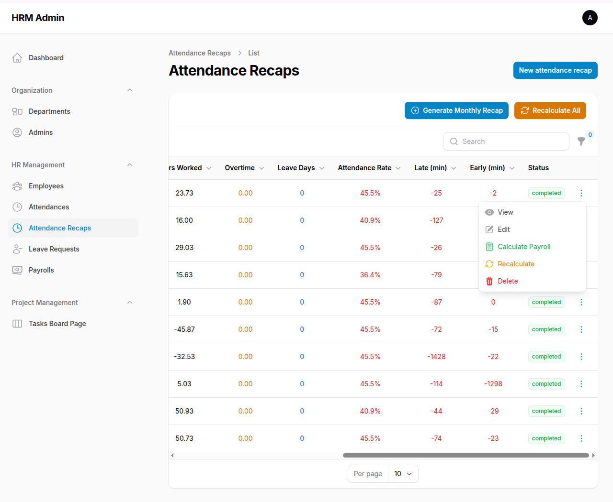

# 🇮🇩 Indonesian HRM System (Open Source)

A modern, Laravel + FilamentPHP-based **Human Resource Management System** tailored for Indonesian businesses. This solution simplifies employee management, payroll (PAYE, NHIF, NSSF), attendance, and more — all in compliance with Indonesian labor laws.



---

## 🔧 Tech Stack

-   **Laravel 12+**
-   **FilamentPHP 3.x** (admin panel)
-   **MySQL/MariaDB** (database)
-   **PHP 8.2+**
-   **Tailwind CSS** (via Filament)
-   **Alpine.js** (via Filament)
-   **Flowforge** (Kanban board for tasks)

---

## 🚀 Features

### ✅ Core Modules

-   **Employee Records** (with KRA PIN, NSSF, NHIF, etc.)
-   **Departments & Positions**
-   **Attendance Management**
-   **Leave Management**
-   **Payroll System** (with Indonesian tax compliance)
-   **Attendance Recap System** (monthly summaries)
-   **Task Board** (Kanban-style project management)
-   **Employee Portal** (self-service access)
-   **Admin Management**

### 🔥 Advanced Features

#### 📊 Attendance Recap System
- **Monthly attendance summaries** for payroll processing
- **Automatic calculation** of working hours, overtime, and attendance rates
- **Late arrival and early departure tracking**
- **Integration with payroll system** for accurate pay calculations
- **Command-line tools** for bulk recap generation

#### 💰 Payroll System
- **Indonesian tax compliance** (PAYE, NHIF, NSSF)
- **Attendance-based calculations** using recap data
- **Multiple pay periods** support
- **Status tracking** (pending, completed, calculated, cancelled)
- **Gross and net pay calculations**

#### 📋 Task Management
- **Kanban board interface** for project management
- **Task assignment** to employees
- **Due date tracking**
- **Status management** (To Do, In Progress, Completed)
- **Visual task organization**

#### 👥 Employee Management
- **Comprehensive employee profiles** with Indonesian-specific fields
- **Emergency contact information**
- **Next of kin details**
- **KRA PIN and national ID tracking**
- **Department and position assignments**
- **Active/inactive status management**

#### 🏢 Department & Position Management
- **Hierarchical department structure**
- **Manager assignments**
- **Position definitions**
- **Employee role management**

#### 📅 Leave Management
- **Leave request tracking**
- **Approval workflows**
- **Leave balance management**
- **Integration with attendance system**

#### ⏰ Attendance Tracking
- **Clock in/out functionality**
- **Shift management**
- **Working hours calculation**
- **Overtime tracking**

---

## 📁 Project Structure

```
app/
├── Filament/
│   ├── Resources/
│   │   ├── EmployeeResource.php
│   │   ├── DepartmentResource.php
│   │   ├── AttendanceResource.php
│   │   ├── AttendanceRecapResource.php
│   │   ├── LeaveResource.php
│   │   ├── PayrollResource.php
│   │   └── AdminResource.php
│   └── Pages/
│       └── TasksBoardPage.php
├── Models/
│   ├── Employee.php
│   ├── Department.php
│   ├── Position.php
│   ├── Attendance.php
│   ├── AttendanceRecap.php
│   ├── Leave.php
│   ├── Payroll.php
│   ├── Task.php
│   └── User.php
└── Services/
    └── AttendanceRecapService.php
```

---

## ⚙️ Installation

```bash
git clone https://github.com/michaelnjuguna/open-source-hrm.git
cd open-source-hrm

composer install
cp .env.example .env
php artisan key:generate

# Setup DB credentials in .env
php artisan migrate --seed

composer run dev
```

## 🛠️ Usage

### Attendance Recap Generation

```bash
# Generate recap for all employees (current month)
php artisan attendance:generate-recap

# Generate recap for specific employee
php artisan attendance:generate-recap --employee=1

# Generate recap for specific month
php artisan attendance:generate-recap --year=2024 --month=8

# Recalculate existing recaps
php artisan attendance:generate-recap --recalculate
```

### Payroll Processing

1. Generate attendance recaps for the month
2. Create payroll records with attendance data
3. Calculate gross and net pay
4. Process payments

### Task Management

- Access the Tasks Board from the admin panel
- Create tasks and assign to employees
- Track progress using the Kanban interface
- Set due dates and priorities

---

## 📚 Documentation

- [Attendance Recap System](docs/ATTENDANCE_RECAP.md) - Detailed guide for the attendance recap feature

---

## 🤝 Contributing

All contributions are welcome. Please fork the repo, create a feature branch and submit a pull request.

### Development Setup

```bash
# Install dependencies
composer install
npm install

# Run development server
composer run dev
```

---

## 📜 License

[MIT license](LICENSE)

Made with ❤️ for Indonesian businesses
